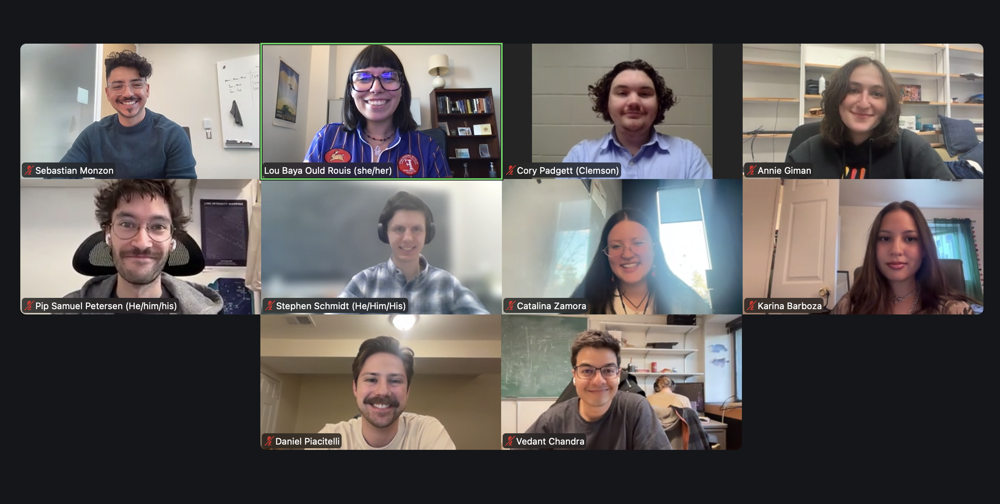

The Astro Grad Congress held its Fall General Body Meeting on **November 18th, 2025**, with **10 graduate representatives** in attendance.

The steering committee opened by giving the following updates and reminders:
- We are looking for motivated early-grad representatives to join the steering committee as some members have graduated!
- We want to have blog posts up by the end of January from the subcommittees on Grad Involvement in Faculty Hiring and Outreach Database.

Daniel Piacitelli gave an update on graduate admissions on behalf of the Working Group on Grad Admissions (WGGA) formed by the AAS Graduate Admissions Task Force to serve as an immediate community resource, finalize recommendations towards the implementation of a common-app system. Specifically, the admission to Astronomy-granting PhD programs for this upcoming cycle have been reported in a [spreadsheet](https://docs.google.com/spreadsheets/d/1n4ZCoZpJ44TlD_jnQFlCJ5d4PXVYh36ce6ZQiCoVo_E/edit?gid=0#gid=0) which informs that at least 20% of programs will be admitting smaller cohorts, and 2% have cancelled the admission cycle as a whole. Prospective visits may also be affected, and even canceled in a number of schools. 

The meeting then moved to breakout rooms for subcommittee’s to work on the action items for the upcoming blog posts. Previous updates on each subcommittee can be found on this [AGC blog post](https://astro-grad-congress.github.io/update/). 

Stay tuned for more!
